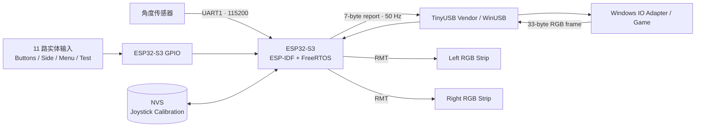
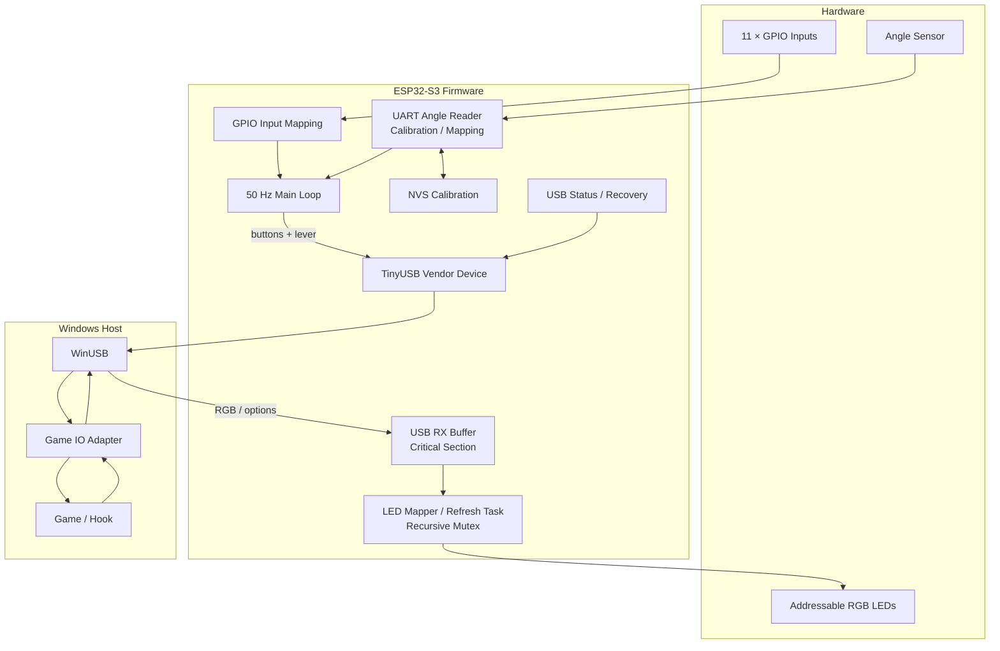
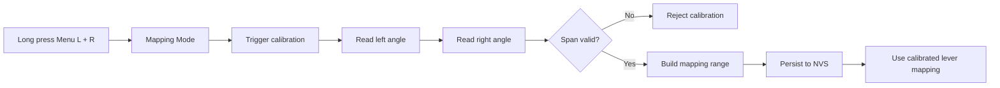

# E.N.C Controller — ESP32-S3 Firmware

面向街机 / 音游控制器的 **ESP32-S3 嵌入式固件**。项目负责把实体按键、摇杆角度传感器和 RGB 灯效接入 Windows 游戏侧，完成从 **GPIO / UART → MCU → USB WinUSB → PC** 的双向实时通信。

**ESP32-S3 · ESP-IDF 5.4.2 · C · FreeRTOS · TinyUSB · WinUSB · GPIO · UART · NVS · RMT RGB LED**

> **项目定位**：E.N.C Controller 的主控固件与硬件侧通信实现。  
> **实际使用**：用于实体控制器联调与小批量交付，覆盖输入采集、摇杆标定、USB 通信、RGB 灯效和异常恢复。

---

## Demo

这个仓库公开的是 **MCU / Hardware-side firmware**。完整运行时，数据链路如下：



### 一次完整运行会发生什么

1. ESP32-S3 启动后初始化 11 路输入、UART 角度传感器、RGB 灯带和 TinyUSB Vendor 设备；
2. Windows 将设备识别为 **E.N.C Controller**，通过 WinUSB 与固件通信；
3. 主循环每 **20 ms / 50 Hz** 采集按键与摇杆位置，编码成 7 字节输入帧发送到 PC；
4. PC 将游戏 RGB 状态封装为 33 字节数据帧回传；
5. 固件在 USB 回调中只完成快速收包，实际 LED 更新移到主循环 / 后台任务，避免阻塞 USB；
6. RGB 数据映射到左右灯组，并通过 ESP-IDF `led_strip` / RMT 驱动实体灯效；
7. USB Vendor 接口异常时，固件持续检查挂载状态并执行连接恢复；
8. 摇杆完成标定后将参数写入 NVS，重新上电可直接恢复。

---

## System Architecture



---

## Firmware Data Path

### ESP32 → PC: input report

每个输入周期发送固定 **7 字节**：

| Offset | Size | Field | Description |
| --- | ---: | --- | --- |
| 0–2 | 3 B | Header | `44 44 54` |
| 3 | 1 B | Left buttons | L1 / L2 / L3 / Side / Menu bitfield |
| 4 | 1 B | Right + operation | R1 / R2 / R3 / Side / Menu / Test / Service |
| 5–6 | 2 B | Lever | 摇杆值，小端序 |

按钮使用上拉输入，**低电平表示按下**。当前固件将左右按键分别压缩为 bitfield，再与 Test / Service 状态组合后发送。

### PC → ESP32: RGB / control frame

固件接收固定 **33 字节**帧：

| Offset | Size | Field |
| --- | ---: | --- |
| 0–2 | 3 B | Header: `44 4C 01` |
| 3–20 | 18 B | IO4 RGB: L1–L3 / R1–R3 |
| 21–32 | 12 B | Side LED field / reserved extension |

USB 层使用 Vendor Class，端点为：

- OUT: `0x03`
- IN: `0x84`
- Endpoint size: **64 B**
- RX / TX buffer: **256 B**

---

## Embedded Engineering Highlights

| 方向 | 实现 |
| --- | --- |
| **MCU / RTOS** | ESP32-S3，ESP-IDF 5.4.2；FreeRTOS 主循环与独立 LED refresh task |
| **USB Device** | TinyUSB Vendor Class + Microsoft OS 2.0 Descriptor，面向 Windows WinUSB |
| **Input Scan** | 11 路 GPIO 上拉输入，按键状态编码为左右 bitfield |
| **Realtime Loop** | 主链路 20 ms 周期，即 **50 Hz** 输入上报 |
| **Angle Sensor** | UART1 115200 读取角度，映射为 16-bit lever 数据 |
| **Calibration** | 支持现场摇杆标定、最小跨度校验、映射边界留量及 NVS 持久化 |
| **RGB Output** | 接收 PC 灯效帧，完成 IO4 / Side RGB 数据映射并经 RMT 驱动灯带 |
| **Concurrency** | USB RX 数据使用 critical section；LED 硬件访问使用 recursive mutex |
| **Non-blocking USB** | USB RX callback 只做校验 / 拷贝 / pending 标记，耗时灯效更新移出回调 |
| **Fault Recovery** | Vendor mount 状态检测、连续失败计数、缓冲区清理和连接恢复 |
| **Diagnostics** | USB mount / FIFO / heap / stack high-water mark / task state 日志与诊断接口 |

---

## Joystick Calibration

摇杆不是简单写死一个角度区间，而是带有现场标定流程。

当前逻辑：

1. 长按左右 Menu **5 秒**切换映射模式；
2. 进入映射模式时通过 RGB 灯给出提示；
3. 同时触发左右 Side 后开始采样；
4. 获取左右端角度并计算有效跨度；
5. 跨度过小时判定标定失败；
6. 有效结果转换为 reference / min delta / max delta；
7. 标定区间两侧保留角度余量；
8. 参数保存到 ESP32 NVS；
9. 后续开机自动加载，无需重复配置。



---

## USB Reliability

USB 通信是这个项目里投入较多工程调试的部分。

### 1. 回调不做重活

`tud_vendor_rx_cb()` 只执行：

```text
validate size
  → copy packet
  → update length
  → mark LED data pending
  → return
```

RGB 写灯操作放在正常任务上下文执行，避免在 USB callback 中阻塞。

### 2. 缓冲区与并发保护

- Vendor RX / TX buffer 扩展到 **256 B**；
- 接收共享缓冲区使用 FreeRTOS critical section；
- RGB 刷新路径使用 recursive mutex；
- 对输入长度和目标结构体执行边界检查。

### 3. 持续状态检查

固件持续监测：

- USB mounted；
- Vendor interface mounted；
- TX / RX available；
- free heap；
- task stack high-water mark；
- pending packet 状态。

Vendor 接口连续异常达到阈值后执行恢复逻辑，避免设备只能通过人工重新插拔恢复。

---

## RGB Pipeline

游戏侧 RGB 最终被拆分为左右两组实体灯带：

```text
Game RGB
   ↓
Windows IO Adapter
   ↓  WinUSB
33-byte packet
   ↓
ESP32-S3
   ├─ IO4 RGB: L1 L2 L3 R1 R2 R3
   └─ Side RGB: LS / RS
   ↓
mapping
   ↓
ESP-IDF led_strip / RMT
   ↓
physical LEDs
```

固件还维护最后一帧有效 RGB 数据，并由后台任务周期性重新应用，避免灯带短暂掉电或没有新帧时丢失显示状态。

---

## Repository Structure

```text
ENC-Controller-MAIN-HARDWARE/
├─ main/
│  ├─ main.c                  # 50 Hz 主循环 / 初始化 / USB状态恢复
│  ├─ GPIO_My.c/.h           # 11路输入、UART角度、标定与NVS
│  ├─ winusb_new.c/.h        # TinyUSB Vendor / WinUSB 双向通信
│  ├─ LED_My.c/.h            # RGB灯带初始化与硬件接口
│  ├─ usb_descriptors.h      # USB VID/PID 与设备描述符
│  ├─ tusb_config_custom.h   # Vendor FIFO / endpoint 配置
│  └─ *.md                   # USB / LED / 数据映射调试记录
├─ old/
│  └─ hid.c/.h               # 早期 HID 方案，已被当前 WinUSB 实现替代
├─ winusb_driver/            # Windows WinUSB driver files
├─ managed_components/       # ESP-IDF Component Manager dependencies
├─ sdkconfig
├─ sdkconfig.defaults
└─ CMakeLists.txt
```

> `managed_components/` 主要是依赖代码；阅读项目时建议优先从 `main/main.c`、`GPIO_My.c` 和 `winusb_new.c` 开始。

---

## Build & Flash

要求：

- ESP-IDF **5.x**（当前 lock file 为 **5.4.2**）
- ESP32-S3
- USB Device capability

```bash
idf.py set-target esp32s3
idf.py build
idf.py flash monitor
```

默认配置启用一个 TinyUSB Vendor interface：

```text
CONFIG_TINYUSB_VENDOR_COUNT=1
CONFIG_TINYUSB_HID_COUNT=0
CONFIG_TINYUSB_CDC_COUNT=0
```

---

## Hardware Interface

当前固件主要接口：

- **11 × GPIO inputs**：左右主按键、Side、Menu、Test；
- **UART1 @ 115200**：角度传感器；
- **USB Device**：ESP32-S3 Native USB → WinUSB；
- **RMT / led_strip**：左右 RGB 灯带；
- **NVS**：摇杆标定参数。

主要 GPIO 定义位于 [`main/GPIO_My.h`](main/GPIO_My.h)。

---

## Scope

本仓库重点展示 **嵌入式主控与 USB / 外设链路**。

Windows 游戏 Hook / IO 适配层在运行链路中负责将游戏输入输出转换为本固件使用的协议，但其完整源码不属于当前仓库。仓库中的协议与调试文档保留了双方接口、LED 数据映射和多进程通信问题的分析记录。

---

## Related Engineering Notes

如果想看实际调试过程，可以继续阅读：

- [WinUSB implementation](main/WINUSB_NEW_README.md)
- [USB reliability fixes](main/USB_DEEP_FIX_README.md)
- [Data mapping](main/CLEAR_DATA_MAPPING.md)
- [LED channel verification](main/LED_CHANNEL_VERIFICATION.md)
- [Inter-process communication analysis](main/INTER_PROCESS_COMMUNICATION.md)
- [Project completion notes](main/PROJECT_COMPLETION_SUMMARY.md)

---

## License

See [LICENSE](LICENSE).
